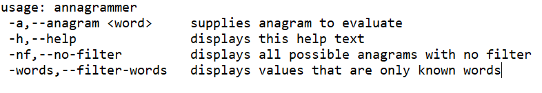

# AnagrammerCLI
Command-Line-Interface application to help solve anagram codes and messages! Written in java.

# To Run
The CLI requires input to main. Passing `-h` to main will result in output similar to this:

